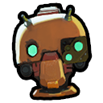
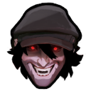
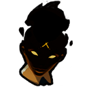
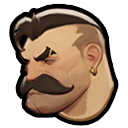
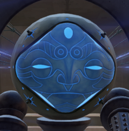
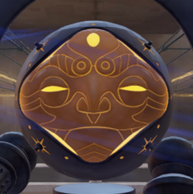
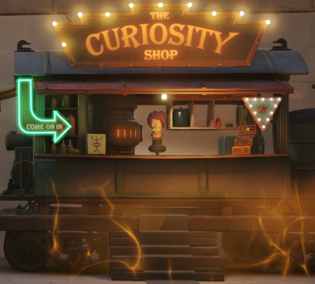
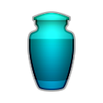

## 🎙️ **О качестве дубляжа**:

Многие скептически относятся к **нейросетевому дубляжу**, и зачастую справедливо: голоса могут звучать **неестественно**. Однако в **Deadlock**, где реплики персонажей — это скорее **важные штрихи к лору**, а не основа геймплея, такой подход раскрывается с лучшей стороны. Он позволяет услышать героев на родном языке и **глубже погрузиться** в атмосферу игры.

**Что уже удалось сделать:**

В моей работе я стремился к **живости**: герои делают **паузы, расставляют акценты и передают эмоции**, избегая **монотонности**, свойственной многим ИИ-генерациям. По сравнению с другими попытками AI-дубляжа, этот вариант звучит гораздо **более органично**.

**Текущие проблемы и план их решения:**

Я честно признаю, что озвучка **не идеальна**. На текущем этапе около **30% фраз** требуют доработки: встречаются *неверные ударения, артефакты звука или проскальзывающий английский акцент*. К счастью, все эти недочеты **исправимы** — это лишь вопрос времени и тщательной полировки.

**Почему проект представлен сейчас:**

Valve проделали **колоссальную работу**, записав около **1700 реплик** на каждого героя. Прослушать и отполировать такой объем в одиночку — задача **титаническая**. Поэтому сейчас я сосредоточился на количестве, чтобы представить вам **«ядро» озвучки** для ключевых персонажей. 
На данный момент я использую образцы голосов из игры DOTA2, чтобы "не у кого не воровать".

---

### **Теперь слово за вами!**

Мне крайне важно услышать **мнение русскоязычного сообщества**: **стоит ли продолжать** этот проект, доводить его до идеала и озвучивать остальных героев? Ваша **поддержка и отзывы** решат его дальнейшую судьбу.

## **🎬Трейлер**

<video controls width="80%">

  <source src="assets/video/rudead_trailer1.mp4" type="video/mp4">

  Ваш браузер не поддерживает видео.

</video>

## 🎧 **Демонстрация героев**

| Герой | Демо | Качество озвучки |
|-------|------|------------------|
| 
 Bebop
 | <audio controls><source src="assets/demo/bebop_select_03.mp3" type="audio/mpeg"></audio> <audio controls><source src="assets/demo/bebop_upgrade_power3_03.mp3" type="audio/mpeg"></audio> | Отлично 🌟 |
| 
 Paige
 | <audio controls><source src="assets/demo/bookworm_match_start_bookworm_frank_convo01_01.mp3" type="audio/mpeg"></audio> <audio controls><source src="assets/demo/bookworm_select_01.mp3" type="audio/mpeg"></audio> | Терпимо 🙂 |
| 
 Drifter
 | <audio controls><source src="assets/demo/drifter_match_start_drifter_mirage_convo01_07.mp3" type="audio/mpeg"></audio> <audio controls><source src="assets/demo/drifter_select_01.mp3" type="audio/mpeg"></audio> | Терпимо 🙂 |
| 
 Dynamo
 | <audio controls><source src="assets/demo/dynamo_match_start_dynamo_haze_convo03_01.mp3" type="audio/mpeg"></audio> <audio controls><source src="assets/demo/dynamo_upgrade_power4_06.mp3" type="audio/mpeg"></audio> | На доработке 🔧 |
| 
 McGunnis
 | <audio controls><source src="assets/demo/forge_sad_03.mp3" type="audio/mpeg"></audio> <audio controls><source src="assets/demo/forge_unselect_09.mp3" type="audio/mpeg"></audio> | На доработке 🔧 |
| 
 Haze
 | <audio controls><source src="assets/demo/haze_kill_shiv_01.mp3" type="audio/mpeg"></audio> <audio controls><source src="assets/demo/haze_match_start_dynamo_haze_convo03_02.mp3" type="audio/mpeg"></audio> | Отлично 🌟 |
| 
 Lash
 | <audio controls><source src="assets/demo/lash_kill_bebop_04.mp3" type="audio/mpeg"></audio> <audio controls><source src="assets/demo/lash_upgrade_power1_10.mp3" type="audio/mpeg"></audio> | Отлично 🌟 |
| 
 Patron Female
 | <audio controls><source src="assets/demo/patron_female_enemy_dynamo_start_03.mp3" type="audio/mpeg"></audio> <audio controls><source src="assets/demo/patron_female_killstreak_count_02.mp3" type="audio/mpeg"></audio> | Терпимо 🙂 |
| 
 Patron Male
 | <audio controls><source src="assets/demo/patron_male_ally_shiv_start_04.mp3" type="audio/mpeg"></audio> <audio controls><source src="assets/demo/patron_male_ally_vampirebat_start_03.mp3" type="audio/mpeg"></audio> | Терпимо 🙂 |
| 
 Shopkeeper
 | <audio controls><source src="assets/demo/shopkeeper_hotdog_buy_early_13.mp3" type="audio/mpeg"></audio> <audio controls><source src="assets/demo/shopkeeper_hotdog_buy_refresher_01.mp3" type="audio/mpeg"></audio> <audio controls><source src="assets/demo/shopkeeper_hotdog_buy_tech_01.mp3" type="audio/mpeg"></audio> | Отлично 🌟 |
| 
 Spirit Jar
 | <audio controls><source src="assets/demo/spirit_jar_idol_holder_stalls_03.mp3" type="audio/mpeg"></audio> <audio controls><source src="assets/demo/spirit_jar_idol_waiting_on_bridge_17.mp3" type="audio/mpeg"></audio> | Отлично 🌟 |

---

## 💖 **Поддержать проект**

Если вам нравится этот проект и вы хотите поддержать его развитие, вы можете сделать пожертвование через ЮMoney. Любая сумма будет очень полезна!

  

    <iframe src="https://yoomoney.ru/quickpay/fundraise/button?billNumber=1COE4K88Q5B.250913&" 
            width="330" height="50" frameborder="0" allowtransparency="true" scrolling="no"></iframe>
  

  

    <i>(SberPay, МИР, Mastercard, Visa, Maestro)</i>
  

## **Перспективы**

Я могу озвучивать одного героя в день, а также озвучивать новых героев (спойлер: новых героев введут уже совсем скоро, судя по готовым фразам), если сообществу понравится озвучка

## License

This project is licensed under the Creative Commons Attribution-NonCommercial-ShareAlike 4.0 International License (CC BY-NC-SA 4.0).  
See the [LICENSE](LICENSE) file for details.

---

### Disclaimer
Deadlock © Valve Corporation.  
This is a non-commercial fan project and is not affiliated with or endorsed by Valve.  
All rights to the original game and its assets belong to Valve.
