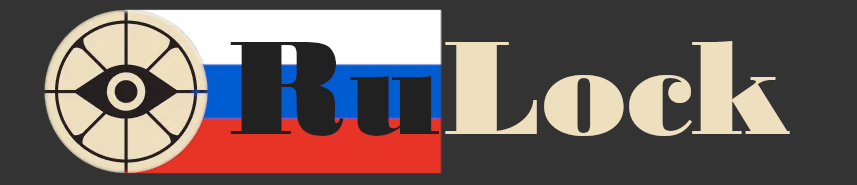

## 🎙️ **О качестве дубляжа**:

Многие скептически относятся к **нейросетевому дубляжу**, и зачастую справедливо: голоса могут звучать **неестественно**. Однако в **Deadlock**, где реплики персонажей — это скорее **важные штрихи к лору**, а не основа геймплея, такой подход раскрывается с лучшей стороны. Он позволяет услышать героев на родном языке и **глубже погрузиться** в атмосферу игры.

**Что уже удалось сделать:**

В моей работе я стремился к **живости**: герои делают **паузы, расставляют акценты и передают эмоции**, избегая **монотонности**, свойственной многим ИИ-генерациям. По сравнению с другими попытками AI-дубляжа, этот вариант звучит гораздо **более органично**.

**Текущие проблемы и план их решения:**

Я честно признаю, что озвучка **не идеальна**. На текущем этапе около **30% фраз** требуют доработки: встречаются *неверные ударения, артефакты звука или проскальзывающий английский акцент*. К счастью, все эти недочеты **исправимы** — это лишь вопрос времени и тщательной полировки.

**Почему проект представлен сейчас:**

Valve проделали **колоссальную работу**, записав около **1700 реплик** на каждого героя. Прослушать и отполировать такой объем в одиночку — задача **титаническая**. Поэтому сейчас я сосредоточился на количестве, чтобы представить вам **«ядро» озвучки** для ключевых персонажей. 
На данный момент я использую образцы голосов из игры DOTA2, чтобы "не у кого не воровать".

---

### **Теперь слово за вами!**

Мне крайне важно услышать **мнение русскоязычного сообщества**: **стоит ли продолжать** этот проект, доводить его до идеала и озвучивать остальных героев? Ваша **поддержка и отзывы** решат его дальнейшую судьбу.

## **🎬Трейлер**

<video controls width="80%">

  <source src="assets/video/rulock_trailer1.webm" type="video/webm">

  Ваш браузер не поддерживает видео.

</video>

## 🚀 Страница с демонстрациями

## 💖 **Поддержать проект**

Если вам нравится этот проект и вы хотите поддержать его развитие, вы можете сделать пожертвование через ЮMoney. Любая сумма будет очень полезна!

  
   
  <i>SberPay, МИР, Mastercard, Visa, Maestro</i>

## 🌅**Перспективы**

Я могу озвучивать одного героя в день, а также озвучивать новых героев (спойлер: новых героев введут уже совсем скоро, судя по готовым фразам), если сообществу понравится озвучка

## ⚙️**Как установить:**

1. Скачайте архив и распокуйте его в папке <i>"\steamapps\common\Deadlock\game\citadel"</i>
2. У вас должно получится <i>"steamapps\common\Deadlock\game\citadel\addons"</i>
3. Откройте файл **gameinfo.gi** в папке citadel через блокнот
4. Измените блок  SearchPaths 
на  ``SearchPaths
		{
			// These are optional language paths. They must be mounted first, which is why there are first in the list.
			// *LANGUAGE* will be replaced with the actual language name. If not running a specific language, these paths will not be mounted
			Game_Language		citadel_*LANGUAGE*
            Game                citadel/addons
            Mod                 citadel
            Write               citadel          
            Game                citadel
            Write               core
            Mod                 core
            Game                core 
		}``

## License

This project is licensed under the Creative Commons Attribution-NonCommercial-ShareAlike 4.0 International License (CC BY-NC-SA 4.0).  
See the [LICENSE](LICENSE) file for details.

---

### Disclaimer
Deadlock © Valve Corporation.  
This is a non-commercial fan project and is not affiliated with or endorsed by Valve.  
All rights to the original game and its assets belong to Valve.
